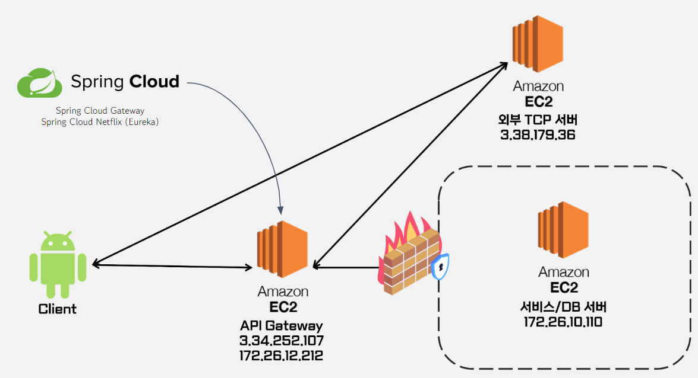
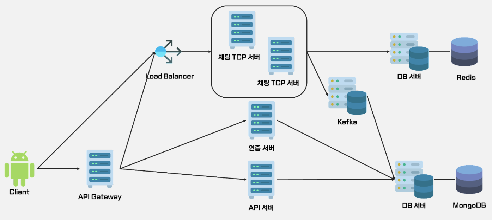
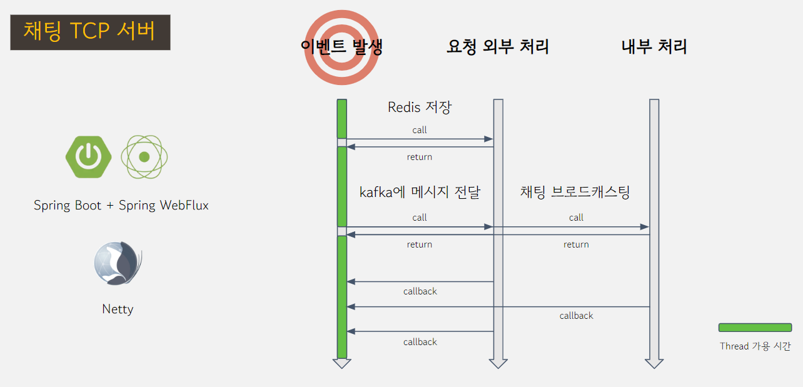
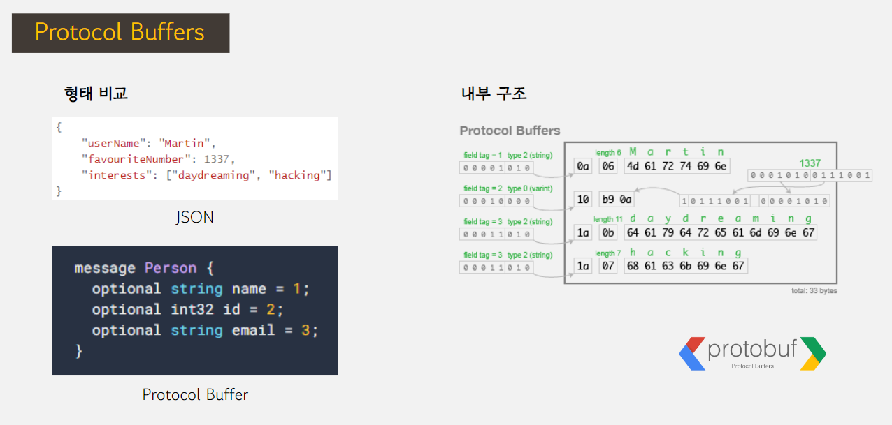
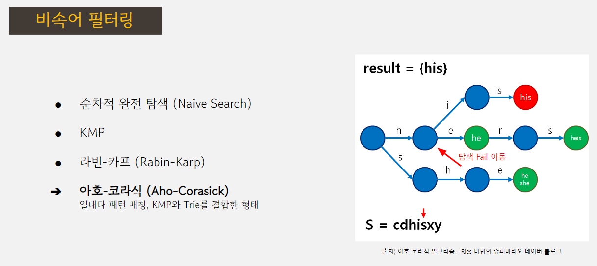
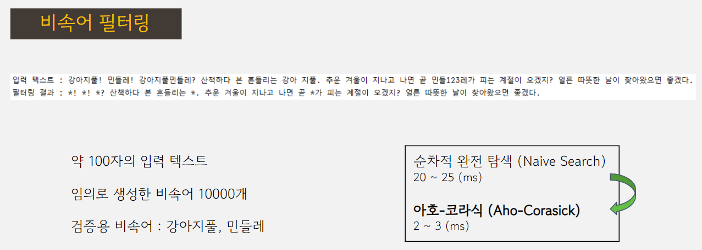
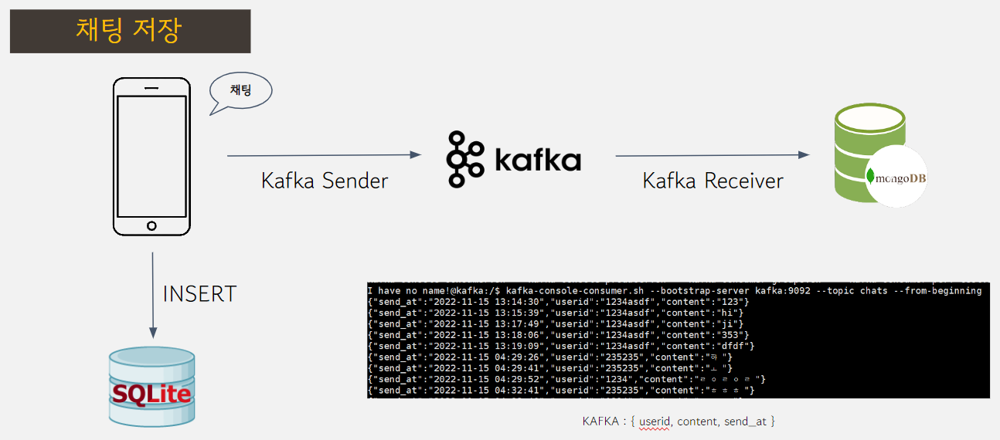

# 🚇 이름 모를 지하철, Emoji 😄

---

### **🛠 개발 환경 **

- Front-end

  > *Flutter 3.3.7*
  >
  > *Dart 2.18.4*
  >
  > *DevTools 2.15.0*

- Back-end

  > *Spring 2.7.5*
  >
  > *Java 1.8*
  >
  > *Kafka 3.1.2*
  >
  > *MongoDB 4.4.17*
  >
  > *Redis 5.0.7*

 
---

### **👨🏻‍🤝‍👨🏻 업무 분담 내역 **

|  팀원  |              역할              |
| :----: | :----------------------------: |
| 한** |        팀장, Front-end, Client Chatting        |
| 정** |        Front-end, HTTP 통신        |
| 도** | Front-end, Social, Design |
| 박지원 |      Back-end, Chatting Server      |
| 조** |        Back-end, Gateway        |
| 최** | Back-end, Service, DB |

 

---

1. **서버 구성**

   

   > 서버는 EC2 3대로 구성된다.
   >
   > spring cloud gateway -> 모든 요청을 gateway가 받고 사전에 등록된 api의 경로를 이용하여 특정 서버에 요청을 보내준다. 특히 각 서비스마다 따로 인증요청을 하지 않도록 filter를 이용하여 사용자의 jwt토큰을 가지고 인증과정을 거치고 권한을 확인한다.
   >
   > spring cloud eureka -> Service Registry & Discovery, 서버들을 등록하고 각 서비스들로부터 30초마다 heartbeat 신호를 받아 해당 서버가 정상상태라는 것을 확인하고 로드밸런싱 기능을 수행한다.
   >
   > 서비스 api서버, 인증서버, db관련 서버들은 하나의 서버에 도커 컨테이너로 띄워져 있으며, 이 서버는 private으로 구성되어 외부에서 접근이 불가하다.
   >
   > 채팅서버는 docker를 이용하여 2개를 띄워놓은 상태이다.

 

2. **아키텍쳐**

	
	
	> 서울 전역의 지하철에서 사용할 수 있도록 수많은 클라이언트가 동시에 연결되는 케이스를 고려하여 설계를 진행하였다.
	>
	> 모든 api 요청은 gateway를 통해 필터링되며, 그 중 채팅서버에 대한 요청은 로드 밸런서를 통해 적합한 채팅서버로 분산된다.
	>
	> 채팅서버에서 db에 채팅 내용을 저장하는 과정을 blocking 없이 처리하기 위해서 직접 수행하지 않고 kafka를 통해 처리함또한, 실시간으로 운영중인 서버의 객체, 유저 데이터를 관리하기 위해서 Redis에 데이터의 맵핑 정보를 저장하여 관리한다.
	>
	> 채팅 서버를 두 개로 구성하여 채팅 서버의 과부하를 방지한다.

 

---

### **✏ 기능 소개 **

1. **Splash Screen**

   

   > 앱이 실행된다면, 사용자는 기차가 이동하는 듯한 애니메이션을 마주하게 된다.
   >
   > 이 시간 동안, 내부적으로 로그인 정보가 Secure Storage 내에 있는지 확인하게 된다.

 

2. **로그인 페이지**

   

   > 사용자는 앱을 설치하고 처음 실행한다면 '카카오 로그인'을 진행하여야 한다.
   >
   > 로그인에 성공한다면 카카오톡으로 부터 Access Token을 넘겨받게 되는데, 이는 서버로 전송하여 서버에서는 새로운 JWT Token을 클라이언트로 전달하게 된다. 이 정보는 Secure Storage로 저장하여, 모든 API 요청에 Token을 전송하여 유효한지 검사할 수 있게 된다.

 

3. **메인 페이지**

   

   

   > 메인 페이지에서 사용자는 현재 위치와 근접한 역의 정보를 받아올 수 있게 된다.
   >
   > 탑승 1분전부터 실제로 탑승하는 열차의 채팅방에 입장할 수 있다.
   >
   > 화면의 하단에는 오늘의 한마디를 보여줄 수 있게 띄워놓았다.

 

4. **채팅 페이지**

   

   > 같은 열차 내에 있는 사용자들끼리 대화를 할 수 있다.
   >
   > 채팅 기능 이외에도 채팅방 내에는 신고 기능, 도착지 알람 기능, 하차 도움 기능, 자리 양도 기능, 빌런 제보 기능들이 있다.

   - *신고 기능*

     

     > 다른 사용자의 아이콘을 클릭하면 신고할 수 있다.
     >
     > 운영자에게 알림이 가게 되고, 추후 채팅내역을 검토하여 제재를 가할 수 있다.

   - *도착지 알람 기능*

     

     > 자신이 탄 열차의 호선에 따라 목적지를 필터링하여 간편하게 검색할 수 있다.
     >
     > 채팅창 내에서 여러 기능을 즐기는 사용자는 도착지에 근접하였을때 알람을 받을 수 있다.

   - *하차 도움 기능*

     

     > 기획 단계에서, 다소 소극적인 사용자들을 위해 어떤 기능을 추가하면 좋을지에 대해서 마련한 방안이기도 한데, 북적이는 열차 내에서 하차하기 힘든 사용자들을 위해 버튼을 만들어 보았다.
     >
     > 버튼을 누른다면, 스피커에서 내리고자하는 사람의 목소리를 사람들에게 들려줄 것이다.

   - *자리 양도 기능*

     

     > 자리에 앉아있는 사용자들은 열차에서 하차하기 전에 자리를 양도할 수 있다.
     >
     > 또한, 서서 전철을 이용하는 사용자들은 자리를 양도받을 수 있게 하는 기능이다.
     >
     > 자리 양도 이벤트를 개최한다면, 해당 채팅창에 입장한 사용자들은 알림을 받아볼 수 있으며, 일정 시간 후에 한 사람에게 자리 위치에 대한 정보를 알려주는 기능이다.

   - *빌런 제보 기능*

     

     

     > 열차 내에는 다양한 '빌런'들이 존재한다. 이들을 직접 보고 싶다거나 혹은 피하고 싶어하는 사용자들을 위해 채팅방 내에 빌런이 몇 명 존재하는지 알 수 있도록 하는 기능이다.
     >
     > 빌런의 출현과 동시에 채팅방에 입장한 사용자들은 알림을 받아볼 수 있다.

 

---

### **🗝 기능 구현 방법 정리 **

이 장에서는 기능을 구현한 Back-end 역할을 담당한 팀원들이 기능이 내부적으로 어떻게 동작하는지 자세히 설명해주었는데, 이에 대해 작성해보고자 한다.

1. **채팅 TCP 서버 구현**

   

   > 직접 서버에서 로직을 처리하는 것 보다 메시지 전달, 다른 서비스 서버에 처리를 요청, DB에 저장하는 과정이 대부분이라고 분석할 수 있었다.
   >
   > 각각의 모바일 클라이언트와 채팅을 TCP 소켓으로 구현하였다.
   >
   > 많은 수의 유저가 동시에 전송하는 수많은 메시지의 브로드캐스팅과 채팅 내역 저장, Redis를 이용하여 서버의 운영정보를 처리하는 과정을 분리하여 수행하기 위해서 Non-blocking I/O 서버를 선택하였다.
   >
   > 때문에 많이 사용되는 tomcat 기반의 Spring MVC가 아니라, TCP 소켓 연결을 이벤트 기반 채널로 구현하여 관리가 쉽고, 비동기 방식을 지원하는 Netty기반의 Spring Webflux로 채팅 서버를 구현하였다.

 

2. **Protocol Buffers 구현**

   

   > gRPC통신에서 사용하는, 구글에서 만든 언어, 플랫폼을 가리지 않는 직렬화된 구조화 데이터타입이다. 다양한 언어들(C++,C#, Dart, Go , Java, Kotllin, Python)을 제공한다.
   >
   > 버퍼 형태이기 때문에 문자열을 그대로 활용하는 JSON보다 용량이 작고, 처리속도가 아주 빠르다
   > 하나의 ProtoBuf를 정의하면, 언어별로 컴파일하여 사용이 가능해 생산성이 높다.
   >
   > 때문에, 바이트버퍼를 기본 통신으로 활용하는 Java의 Netty 서버와 Dart를 기반으로 하는 Flutter 클라이언트 간의 통신에 적합하다고 판단하였다.
   >
   > 이 버퍼를 소켓 통신에서 모든 채팅내용을 변환하여 클라이언트와 서버가 주고 받을 수 있도록 하였다.

 

3. **비속어 필터링 기능 구현**

   

   

   *(비속어 필터링의 기능에 대한 설명과 그에 대한 결과를 나타낸 사진이다.)*

   > Naive 문자열 탐색 - 처음부터 끝까지 모두 훑는 방식이다.
   >
   > KMP : 앞뒤로 동일한 순서를 갖는 문자열을 패스하면서 탐색한다.
   >
   > 라빈-카프 : 해시를 이용해 문자열 해시 비교하는 방식이다.
   >
   > 아호 코라식 (Aho-Corasick) : 다중 패턴 검색 방식이다.
   >
   > 아호코라식은 하나의 문자열을 탐색할 때 다중 검색이 가능하고, 탐색해야 할 금칙어 리스트 수가 많아서 선정하였다.
   >
   > 굉장히 빠른데 단순한 알고리즘으로는 정확하게 매칭되는 문자열만 탐색이 가능하다.
   >
   > 정규 표현식과 함께 사용하여 비속어에 포함된 공백과 숫자, 특수문자를 식별한다.
   >
   > 또한 식별한 비속어의 중복되는 결과와 범위를 구분하여 연속되는 비속어 부분을 하나의 *로 마스킹처리하였다.

 

4. **채팅 저장 기능 구현**

   

   > 익명 채팅 구현을 위해선, 채팅 내역 저장이 필요하였다.
   >
   > 로컬 저장 - SQLite 를 사용하여, 채팅 내역을 로컬 DB 에 저장한다.
   >
   > 서버 저장 - reactive kafka 를 사용하여, 메시징 큐를 통해 채팅 내역을 실시간으로 mongo DB에 저장한다.

 

---

